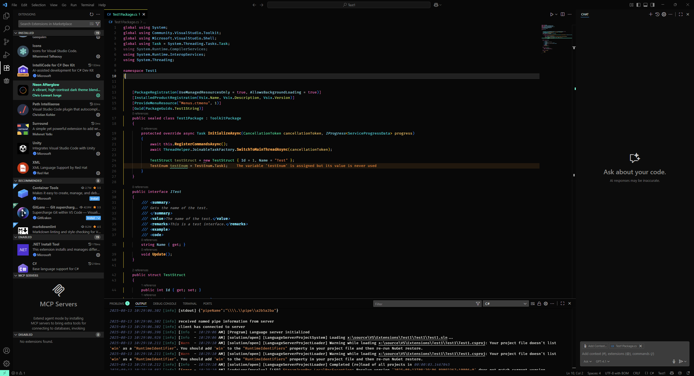
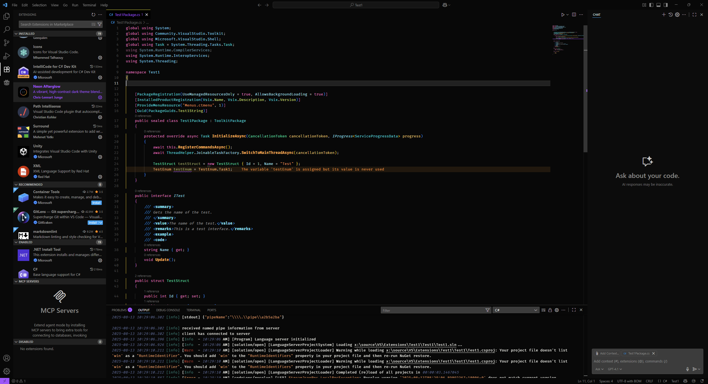

# Neon Afterglow — VS Code Theme  

Neon Afterglow is a high-contrast dark theme combining deep blacks with vibrant neon accents for a crisp, modern coding experience. Designed for readability, focus, and a touch of cyberpunk style.  

- **Base:** `#080808`  
- **Foreground:** `#F8F8F2`  
- **Default accents:** Blue `#00A4F3`, Aqua `#00F3C9`, Neon Yellow `#F3C900`, Neon Red/Pink `#FF5E5E`  
- **Note:** All variants retain yellow (`#F3C900`) for warnings. Variants primarily change UI accent colors (activity bar, selection, picker groups, Git decorations, etc.).  

---

## Variants  

Available themes:  
- **Neon Afterglow** (default)  
- **Neon Afterglow — Orange Accent** `#FF7A00`  
- **Neon Afterglow — Magenta Accent** `#FF2BD1`  
- **Neon Afterglow — Lime Accent** `#B6FF00`  
- **Neon Afterglow — Teal Accent** `#00FFD1`  
- **Neon Afterglow — Violet Accent** `#A94BFF`  

**Select a variant:**  
- **Via Command Palette:** `Preferences: Color Theme` → choose variant  
- **Via settings.json:**  
```json
{
  "workbench.colorTheme": "Neon Afterglow — Orange Accent"
}
```  

---

## Preview  

**Default**  
  

**Orange**  
  

**Magenta**  
  

**Lime**  
  

**Teal**  
  

**Violet**  
  

---

## Installation  

**Marketplace:**  
1. Open the Extensions view in VS Code  
2. Search **"Neon Afterglow"**  
3. Click **Install**  

**Manual (from source):**  
1. Clone this repository  
2. Install dependencies: `npm install`  
3. Package: `npm run package` (creates `.vsix`)  
4. In VS Code: Extensions → `…` → **Install from VSIX…** → select file  
5. Enable via `Preferences: Color Theme`  

---

## Development  

**Requirements:** Node.js 18+, npm, VS Code  

**Scripts:**  
- `npm run build:icon` — Generates `icon.png` (256×256) from `icon.svg`  
- `npm run package` — Builds `.vsix` (runs icon build first)  
- `npm run publish` — Publishes to Marketplace (publisher setup required)  

Use **Developer: Inspect Editor Tokens and Scopes** to fine-tune colors.  

---

## Core Palette  

- **Background:** `#080808`  
- **UI surfaces:** `#0B0B0B`, `#212121`, `#292928`, `#3D3D3C`  
- **Foreground:** `#F8F8F2`  
- **Default accents:** `#00A4F3`, `#00F3C9`, `#F3C900`, `#FF5E5E`  
- **Variant accents:** Orange `#FF7A00`, Magenta `#FF2BD1`, Lime `#B6FF00`, Teal `#00FFD1`, Violet `#A94BFF`  
- **Selection:** `#3A82F7AA`  
- **Warnings/Errors:** `#F3C900` / `#F3002B`  

---

## Configuration Defaults  

This theme sets the following defaults to enhance appearance and usability:  

> **Note:** Values in your `settings.json` override these defaults.  

```json
{
  "configurationDefaults": {
    "editor.renderWhitespace": "selection",
    "editor.cursorSmoothCaretAnimation": "on",
    "editor.smoothScrolling": true,
    "editor.bracketPairColorization.enabled": true,
    "editor.guides.bracketPairs": "active",
    "editor.cursorBlinking": "phase"
  }
}
```  

---

## Contributing  

Issues and PRs are welcome. When reporting color or scope issues, include:  
- Language and code snippet  
- Screenshot (with OS theme, font, ligature info)  
- Suggested color adjustments and variant used  

---

## License  

MIT © CLJunge  
